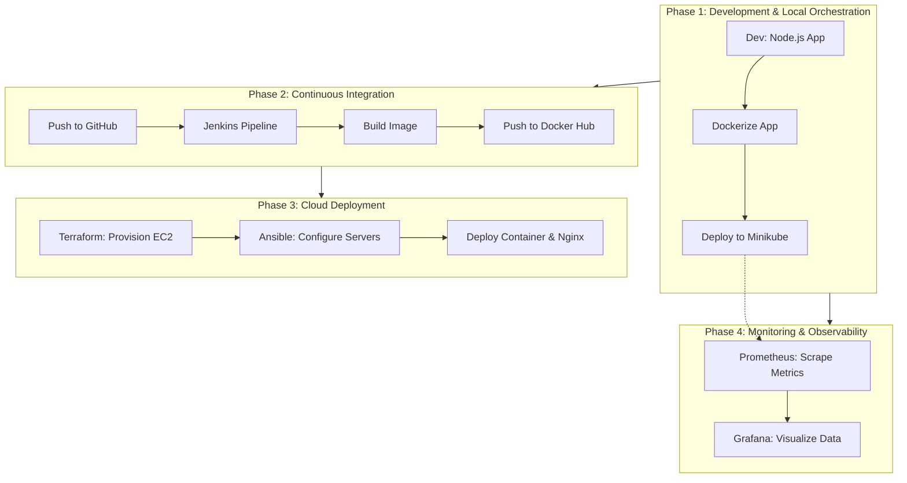

# 🚀 SDLC DevOps Project: Complete Node.js Pipeline

A complete "Zero to Hero" DevOps project demonstrating a full Software Development Life Cycle (SDLC) pipeline. This project moves a simple Node.js application from local development to a production-ready deployment on AWS using industry-standard tools, now including full observability.

## 📋 Project Overview

This project automates the deployment of a Node.js application using a modern DevOps stack.

### 🔄 Pipeline Phases (Architecture)



---

## 🛠️ Technology Stack

* **Application**: Node.js (Express) + `prom-client`
* **Version Control**: Git & GitHub
* **Containerization**: Docker & Docker Hub
* **Local Orchestration**: Minikube (Kubernetes)
* **CI Pipeline**: Jenkins (running in Docker)
* **Infrastructure as Code**: Terraform (AWS Provider)
* **Configuration Management**: Ansible
* **Monitoring**: Prometheus (Metrics) & Grafana (Dashboards)
* **Package Management**: Helm
* **Cloud Provider**: AWS (EC2, VPC, Security Groups)
* **Operating System**: Ubuntu (WSL 2 on Windows 11)

---

## 📂 Project Structure

```bash
sdlc-devops-project/
├── app/                  # Application Source Code
│   ├── server.js         # Node.js entry point (Instrumented)
│   ├── package.json      # Dependencies
│   └── Dockerfile        # Container definition
├── k8s/                  # Kubernetes Manifests (Local)
│   ├── deployment.yaml   # App Deployment
│   ├── service.yaml      # App Service
│   └── service-monitor.yaml # Prometheus Monitor Config
├── terraform/            # Infrastructure Provisioning
│   ├── main.tf           # AWS Resources (EC2, SG, KeyPair)
│   └── terraform.tfstate # State file (ignore in git)
├── ansible/              # Configuration Management
│   ├── inventory.ini     # Server IPs
│   └── playbook.yaml     # Deployment tasks
├── jenkins-setup/        # Custom Jenkins Docker Image
│   └── Dockerfile
└── Jenkinsfile           # CI Pipeline Script
```

---

## 🚀 Phase 1: Development & Local Orchestration

**Goal:** Create the app, containerize it, and run it on a local Kubernetes cluster.

### 1. Build & Test Locally
The application is a simple Express server with a health check endpoint.

```bash
cd app
npm install
node server.js
# Access at http://localhost:3000
```

### 2. Dockerization
Build the container image locally.

```bash
docker build -t <your-dockerhub-user>/devops-node-app:v1 .
docker run -p 3000:3000 <your-dockerhub-user>/devops-node-app:v1
```

### 3. Kubernetes (Minikube)
Deploy to a local Kubernetes cluster to simulate orchestration.

```bash
minikube start
kubectl apply -f k8s/
minikube service node-app-service --url
```

---

## 🔄 Phase 2: Continuous Integration (Jenkins)

**Goal:** Automate the build and push process to Docker Hub upon every code change.

### 1. Setup Jenkins
Run Jenkins in a container with the Docker socket mounted ("Docker-out-of-Docker") to allow it to run Docker commands.

```bash
docker run -d \
  -p 8080:8080 \
  -p 50000:50000 \
  --name jenkins \
  -u root \
  -v /var/run/docker.sock:/var/run/docker.sock \
  -v jenkins_home:/var/jenkins_home \
  my-jenkins-docker:v1
```

### 2. Pipeline Workflow (`Jenkinsfile`)
The pipeline runs the following stages automatically:
1.  **Checkout**: Pulls the latest code from GitHub.
2.  **Build**: Creates a Docker image with a version tag (`:v${BUILD_NUMBER}`).
3.  **Login**: Authenticates with Docker Hub using Jenkins Credentials.
4.  **Push**: Pushes the tagged image and `latest` tag to the registry.
5.  **Cleanup**: Logs out to ensure security.

---

## ☁️ Phase 3: Cloud Deployment (Terraform & Ansible)

**Goal:** Provision AWS infrastructure and deploy the application using configuration management.

### 1. Infrastructure Provisioning (Terraform)
Provisions 2 EC2 instances (Ubuntu) and a Security Group allowing SSH (22) and HTTP (80).

```bash
cd terraform
terraform init
terraform plan
terraform apply
```
*Output:* Returns the public IPs of the new servers (e.g., `54.x.x.x`, `13.x.x.x`).

### 2. Configuration & Deployment (Ansible)
Connects to the raw EC2 instances to turn them into web servers.

**Playbook Tasks:**
* Updates `apt` cache.
* Installs Docker & Nginx.
* Starts Docker service.
* Pulls the Node.js image from Docker Hub.
* Runs the container on port 3000.
* Configures Nginx as a Reverse Proxy (Port 80 -> 3000).

```bash
cd ansible
# Update inventory.ini with the IPs from Terraform output
ansible-playbook -i inventory.ini playbook.yaml
```

### 3. Verification
Access the live application via the AWS Public IPs:
`http://<EC2-PUBLIC-IP>`

---

## 📊 Phase 4: Monitoring & Observability (Prometheus & Grafana)

**Goal:** Implement full-stack observability to visualize real-time application traffic and cluster health.

### 1. Install Helm & Prometheus Stack
Deploy the industry-standard monitoring stack (Prometheus, Grafana, Node Exporter) using Helm.

```bash
# Install Helm (if not installed)
curl https://raw.githubusercontent.com/helm/helm/main/scripts/get-helm-3 | bash

# Add Prometheus Repo
helm repo add prometheus-community https://prometheus-community.github.io/helm-charts
helm repo update

# Install Stack in 'monitoring' namespace
kubectl create namespace monitoring
helm install my-monitoring prometheus-community/kube-prometheus-stack -n monitoring
```

### 2. Instrument Application
The Node.js app is updated with `prom-client` to expose custom metrics at `/metrics`.
* **Metric:** `http_requests_total` (Counter)
* **Scraping:** Configured via `ServiceMonitor` resource.

```yaml
# k8s/service-monitor.yaml
apiVersion: monitoring.coreos.com/v1
kind: ServiceMonitor
metadata:
  name: node-app-monitor
  labels:
    release: my-monitoring
spec:
  selector:
    matchLabels:
      app: node-app
  endpoints:
    - port: http
      path: /metrics
```

### 3. Access Grafana Dashboards
Port-forward Grafana to localhost to view the data.

```bash
# 1. Port Forward
kubectl port-forward svc/my-monitoring-grafana 3000:80 -n monitoring

# 2. Get Admin Password
kubectl get secret --namespace monitoring my-monitoring-grafana -o jsonpath="{.data.admin-password}" | base64 --decode ; echo
```

* **URL:** `http://localhost:3000`
* **User:** `admin`
* **Query:** `rate(http_requests_total[1m])` to see requests per second.

---

## 🧹 Tear Down

To avoid AWS costs, destroy infrastructure when finished.

```bash
cd terraform
terraform destroy
```

## 👤 Author

**Martin Stojkovski**
* GitHub: [MartinS984](https://github.com/MartinS984)

---
*Created as part of the Complete SDLC DevOps Masterclass.*
